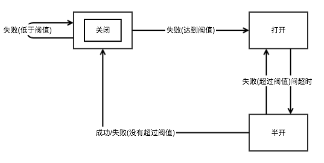

# circuitBreaker
本地熔断器，Java版本

## 熔断器基本原理
> 熔断器是当依赖的服务已经出现故障时，为了保证自身服务的正常运行不再访问依赖的服务，防止雪崩效应

熔断器本身就是一个状态机。
1. **关闭状态**：熔断器的初始化状态，该状态下允许请求通过。当失败超过阀值，转入**打开状态**，
2. **打开状态**：熔断状态，该状态下不允许请求通过，当进入该状态经过一段时间，进入**半开状态**。
3. **半开状态**：在半开状态期间，允许部分请求通过，在半开期间，观察失败状态是否超过阀值。如果没有超过进入**关闭状态**，如果超过了进入**关闭状态**。如此往复。

之前，查了一些资料，网上所有的资料几乎都是针对Hystrix的。这个只是针对分布式系统的接口请求，并不能运用于我们的系统中，因此这种情况下，根据原理自己实现了一个基本的分布式熔断器，数值与计数器存放在redis中，因为redis的操作客户端不一样，我就以本地熔断器为例，讲解熔断器实现。
